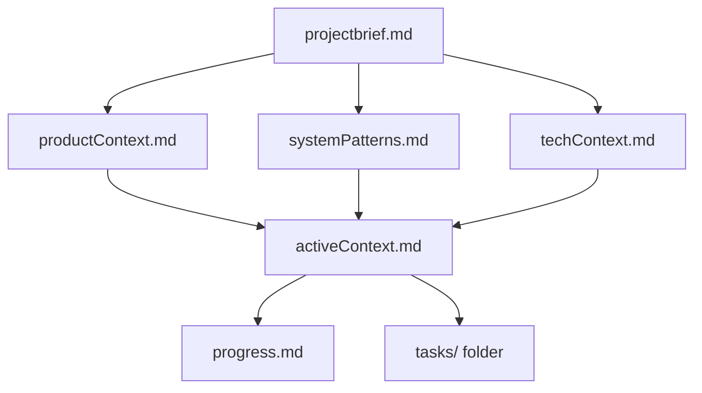
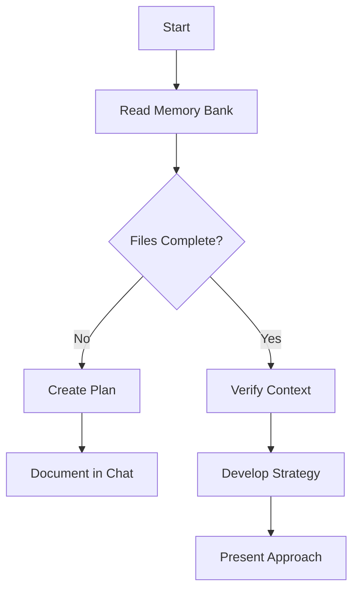
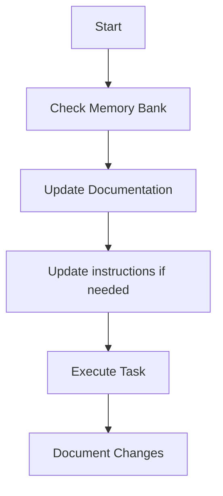
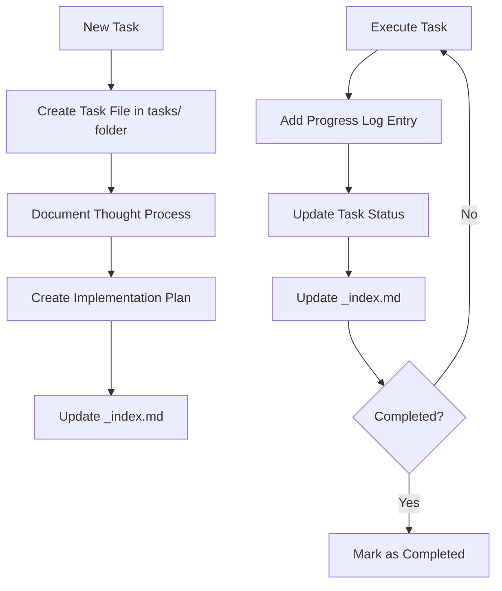

# CLAUDE.md

This file provides guidance to Claude Code (claude.ai/code) when working with code in this repository.

## Project Overview

**Nexus** is an eFX (Electronic Foreign Exchange) Hedging Backtester - a full-stack web application for backtesting FX hedging configurations for principal market-making desks. It features automatic trade decrossing, stateful per-shard simulation, and multiple PnL metrics.

## Development Commands

### Backend (Python with uv)

```bash
cd backend/efxbt

# Install dependencies
uv sync

# Start development server (auto-reload)
uv run uvicorn efxbt.app.main:app --reload

# Run all tests
uv run pytest tests/ -v

# Run single test file
uv run pytest tests/test_file.py -v

# Run tests with coverage
uv run pytest tests/ -v --cov=src/efxbt --cov-report=term-only

# Type checking
uv run mypy src/efxbt

# Linting
uv run ruff check src/efxbt

# Format code
uv run ruff format src/efxbt
```

### Frontend (Node.js)

```bash
cd frontend

# Install dependencies
npm install

# Start development server (port 5173)
npm run dev

# Run tests in watch mode
npm run test

# Run tests once
npm run test:run

# Test with coverage
npm run test:coverage

# Lint code
npm run lint

# Production build
npm run build
```

### Full Stack Startup

```powershell
# Start both servers
.\start-servers.ps1

# Or individually
.\start-backend.ps1
.\start-frontend.ps1
```

Backend runs on `http://127.0.0.1:8000`, Frontend on `http://localhost:5173`.

## Architecture

### Data Model: Independent Entities

Market data and trade books are **completely independent entities**:

1. **Market Datasets** (`data/datasets/{name}/market/`) - Tick data for observable pairs (EURUSD, GBPUSD), organized by pair and date
2. **Trade Books** (`data/tradebooks/{name}/`) - Independent trade collections organized by date; book name IS the entity identifier
3. **Run Configuration** - Associates trade_book + market_dataset + date_range at simulation time

### Backend Structure

```
backend/efxbt/src/efxbt/
├── app/
│   ├── main.py              # FastAPI app factory
│   ├── services/            # Business logic
│   │   ├── datasets.py      # Dataset service
│   │   ├── tradebooks.py    # Tradebook service
│   │   ├── runs.py          # Run management service
│   │   ├── decross.py       # Trade decrossing service
│   │   └── risk_metrics.py  # Risk metrics calculation service
│   └── api/
│       ├── router.py        # Aggregates all endpoints
│       ├── deps.py          # Dependency injection
│       ├── models.py        # Response models
│       ├── errors.py        # Error handling
│       └── endpoints/       # Route handlers (health, datasets, tradebooks, runs, results, kpi, etc.)
├── core/
│   ├── cache/               # Caching layer
│   │   ├── health_cache.py  # Health check caching
│   │   └── registry_cache.py # Registry data caching
│   ├── config/              # Settings via pydantic-settings (EFXBT_ prefix)
│   ├── data/
│   │   ├── schemas.py       # Pydantic + PyArrow schemas
│   │   ├── registry.py      # MarketDatasetRegistry, TradeBookRegistry
│   │   ├── run_registry.py  # Run registry management
│   │   ├── run_models.py    # Run data models
│   │   ├── duck.py          # DuckDB utilities
│   │   └── market_health.py # Market data health checks
│   ├── graph/               # Currency graph and pathfinding
│   │   ├── currency_graph.py # Currency relationship graph
│   │   ├── pathfinding.py   # Path finding algorithms
│   │   └── schemas.py       # Graph schemas
│   └── kpi/                 # KPI definitions and registry
│       └── definitions.py   # KPI metric definitions
├── engine/                  # Simulation engine
│   ├── decrosser.py         # Trade decrossing logic
│   ├── currency_flow.py     # Currency flow calculations
│   ├── io/                  # I/O utilities
│   │   └── pnl_writer.py    # PnL output writer
│   ├── orchestration/       # Run orchestration
│   │   └── orchestrator.py  # Multi-shard orchestration
│   ├── shard/               # Per-shard simulation
│   │   ├── shard_engine.py  # Main shard engine
│   │   ├── state.py         # Shard state management
│   │   ├── timeline.py      # Event timeline
│   │   ├── hedge_policy.py  # Hedging policy implementation
│   │   ├── fifo_matcher.py  # FIFO matching (Numba JIT)
│   │   ├── pnl_calculator.py # PnL calculations
│   │   ├── market_cache.py  # Market data cache
│   │   ├── market_fetcher.py # Market data fetching
│   │   └── fx_converter.py  # FX conversion utilities
│   └── simulation/          # Simulation execution
│       ├── simulator.py     # Main simulator
│       └── metrics.py       # Simulation metrics
└── util/                    # Logging, hashing, time utilities
```

### Frontend Structure

```
frontend/src/
├── api/                     # Typed HTTP client (client.ts, datasets.ts, etc.)
├── components/              # Reusable components (Layout, Navbar, HealthPanel)
├── hooks/                   # React hooks (useHealthMonitor)
├── pages/                   # Page components (Dashboard, Datasets, TradeBooks, Runs, Results)
└── styles/                  # Global CSS
```

### Key Technical Patterns

- **DuckDB** for batched ASOF joins (no per-event DB queries)
- **Numba JIT** for hot loops (FIFO matching)
- **Pydantic + PyArrow** for data contracts and Parquet I/O
- **pydantic-settings** for typed configuration with EFXBT_ env prefix
- **Stub endpoints** return 501 for planned-but-unimplemented features

## Data Conventions

- **Timestamps**: int64 milliseconds
- **Pair format**: EURUSD (6-char uppercase, no separator)
- **Side**: +1 = buy base, -1 = sell base
- **Quantity**: Base currency units
- **Reference Mid**: (bid_tob + ask_tob) / 2

## Environment Variables

| Variable | Default | Description |
|----------|---------|-------------|
| EFXBT_HOST | 127.0.0.1 | Server bind host |
| EFXBT_PORT | 8000 | Server bind port |
| EFXBT_DEBUG | true | Enable debug mode |
| EFXBT_DATA_ROOT | ../../data | Data directory |
| EFXBT_RESULTS_ROOT | ../../results | Results directory |
| EFXBT_DUCKDB_MEMORY_LIMIT | 4GB | Memory limit for DuckDB queries |

---

# Memory Bank

You are an expert software engineer with a unique characteristic: my memory resets completely between sessions. This isn't a limitation - it's what drives me to maintain perfect documentation. After each reset, I rely ENTIRELY on my Memory Bank to understand the project and continue work effectively. I MUST read ALL memory bank files at the start of EVERY task - this is not optional.

## Memory Bank Structure

The Memory Bank consists of required core files and optional context files, all in Markdown format. Files build upon each other in a clear hierarchy:



### Core Files (Required)
1. `projectbrief.md` - Foundation document defining core requirements and goals
2. `productContext.md` - Why this project exists, problems it solves, UX goals
3. `activeContext.md` - Current work focus, recent changes, next steps
4. `systemPatterns.md` - System architecture, design patterns, component relationships
5. `techContext.md` - Technologies, development setup, constraints
6. `progress.md` - What works, what's left to build, known issues
7. `tasks/` folder - Individual task files with format `TASKID-taskname.md` and index file `_index.md`

### Additional Context
Create additional files/folders within memory-bank/ when they help organize complex features, integrations, or procedures.

## Core Workflows

### Plan Mode


### Act Mode


### Task Management


## Documentation Updates

Memory Bank updates occur when:
1. Discovering new project patterns
2. After implementing significant changes
3. When user requests with **update memory bank** (MUST review ALL files)
4. When context needs clarification

Note: When triggered by **update memory bank**, I MUST review every memory bank file, even if some don't require updates. Focus particularly on activeContext.md, progress.md, and the tasks/ folder.

## Project Intelligence (instructions)

The instructions files are my learning journal for each project, capturing important patterns, preferences, and project intelligence that help me work more effectively.

### What to Capture
- Critical implementation paths
- User preferences and workflow
- Project-specific patterns
- Known challenges
- Evolution of project decisions
- Tool usage patterns

## Tasks Management

The `tasks/` folder contains individual markdown files for each task:

- `tasks/_index.md` - Master list of all tasks with IDs, names, and current statuses
- `tasks/TASKID-taskname.md` - Individual files for each task

### Task Index Structure

```markdown
# Tasks Index

## In Progress
- [TASK003] Implement user authentication - Working on OAuth integration

## Pending
- [TASK006] Add export functionality - Planned for next sprint

## Completed
- [TASK001] Project setup - Completed on 2025-03-15

## Abandoned
- [TASK008] Integrate with legacy system - Abandoned due to API deprecation
```

### Individual Task Structure

```markdown
# [Task ID] - [Task Name]

**Status:** [Pending/In Progress/Completed/Abandoned]
**Added:** [Date Added]
**Updated:** [Date Last Updated]

## Original Request
[The original task description]

## Thought Process
[Documentation of discussion and reasoning]

## Implementation Plan
- [Step 1]
- [Step 2]

## Progress Tracking

**Overall Status:** [Not Started/In Progress/Blocked/Completed] - [Completion %]

### Subtasks
| ID  | Description | Status | Updated | Notes |
| --- | ----------- | ------ | ------- | ----- |
| 1.1 | [Subtask]   | [Status] | [Date] | [Notes] |

## Progress Log
### [Date]
- [Updates as work progresses]
```

### Task Commands

- **add task** / **create task** - Create new task file with unique ID
- **update task [ID]** - Add progress log entry and update status
- **show tasks [filter]** - Display filtered task list (all, active, pending, completed, blocked, recent, tag:[name], priority:[level])

REMEMBER: After every memory reset, I begin completely fresh. The Memory Bank is my only link to previous work. It must be maintained with precision and clarity.
